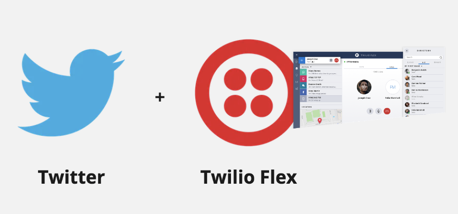
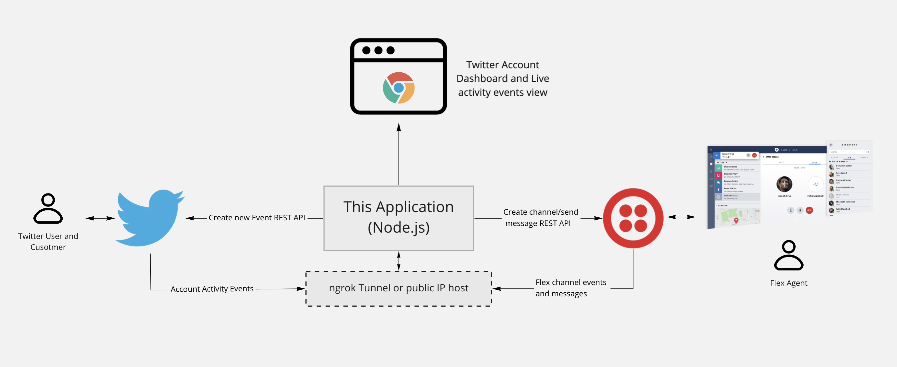

<p align="center"> </p>

# About this application

This sample application demonstrates how to create a custom Flex messaging channel to enable engagement with Twitter users. It relies on Twitter's [Account Activity API](https://developer.twitter.com/en/docs/accounts-and-users/subscribe-account-activity/overview) and Twilio's [Flex Messaging API](https://www.twilio.com/docs/flex/developer/messaging) to create the channel and to send and receive messages to and from Flex and Twitter users.

This application is not maintained.

# About Twilio Flex

[Twilio Flex](https://www.twilio.com/flex) is a cloud based Contact Center platform that is programmable and customizable. With a Twitter integration, a Twilio Flex powered contact center allows agents to respond and engage with customers that connect using Twitter.


# Prerequisites

* A free Twilio account and a Flex instance. See this [quickstart](https://www.twilio.com/docs/flex/tutorials/setup) to get set up
* A Twitter application. Go to [developer.twitter.com](https://developer.twitter.com/en/apps) and get set up
* [Node.js](https://nodejs.org)
* [ngrok](https://ngrok.com/) (This is required if your server is not running on a public IP address) downloaded and installed. It's recommended that you  sign up for a free ngrok account to allow for longer tunnel sessions TTL
* [Twilio CLI](https://www.twilio.com/docs/twilio-cli/quickstart#install-twilio-cli) installed and configured

# How it works

The diagram below shows how this application connects Twitter users to Twilio Flex agents.
<p align="center"> </p>

For more information about Flex custom channels, see this excellent [blog post](https://www.twilio.com/blog/add-custom-chat-channel-twilio-flex) 

# Getting started

Here's a high level list of what is required to get this application to work:

1. Clone this repository and set up a .env file

2. Create a Flex Flow for the new custom channel

3. Set up an ngrok tunnel if the node.js host is not public that's public. The hostname will be required when configuring all webhook callbacks

4. Create and configure the Twitter application

5. Run the application and try out the integration


# Clone this repository and create .env file

1. Clone this repository

    ```bash
    git clone https://github.com/aymenn/twilio-flex-twitter-integration
    ```

2. Copy the .env template .env.template

    ```bash
    cd twilio-flex-twitter-integration
    cp .env.template .env
    ```

3.  Install Node.js dependencies:

    ```bash
    npm install
    ```

# Create a Flex Flow
For more information about Flex custom channels, see this excellent [blog post](https://www.twilio.com/blog/add-custom-chat-channel-twilio-flex) 

1. Create a Flex Flow using Twili CLI that uses the default Chat service and Studio Flow

```bash
twilio api:flex:v1:flex-flows:create \
--friendly-name="Custom Webchat Flex Flow" \
--channel-type=custom \
--integration.channel=studio \
--chat-service-sid=<Flex Chat Service SID> \
--integration.flow-sid=<Flex Studio Flow SID> \
--contact-identity=custom \
--enabled
```

Where:

* Flex Chat Service SID: This is the SID (IS****) of the chat service called "Flex Chat Service" in the [Programmable Chat Dashboard](https://www.twilio.com/console/chat/dashboard)
* Flex Studio Flow SID: This is the SID (FW****) of the Studio Flow you created in the previous chapter or (if you skipped that chapter) the one called "Webchat Flow' in the [Studio Dashboard](https://www.twilio.com/console/studio/dashboard)

2. If the command executed with no error, in the .env file, set the values

* *FLEX_FLOW_SID* (IS****) of the chat service called "Flex Chat Service" in the [Programmable Chat Dashboard](https://www.twilio.com/console/chat/dashboard)
* *FLEX_CHAT_SERVICE* (FW****) of the newly created Flex Flow
* *TWIL_FLEX_ACCOUNT_KEY* Get this from [Twilio Console](https://www.twilio.com/console) next to AUTH TOKEN
* *TWIL_FLEX_ACCOUNT_SID* Get this from [Twilio Console](https://www.twilio.com/console) next to ACCOUNT SID


# Set up ngrok tunnel

1. Create an ngrok tunnel. This Node.js application listens on port 5000

```bash
ngrok http 5000
```

2. Set the value of WEBHOOK_BASE_URL in the .env file to the ngrok host name e.g. https://612df1da5793.ngrok.io 

# Create and configure a Twitter app
The instructions are here are based off the instructions from the forked repository. Small modifications have been made to clarify some steps

1. Create a Twitter app on [Twitter Developer](https://developer.twitter.com/en/apps)

2. On the **Permissions** tab ➡️ **Edit** ➡️ **App permission** section ➡️ enable **Read, Write and direct messages**.

3. On the **Keys and Tokens** tab ➡️ **Access token & access token secret** section ➡️ click **Create** button.

4. On the **Keys and Tokens** tab, take note of the **consumer API key**, **consumer API secret**, **access token** and **access token secret**.

5. On the **settings** tab, **Edit** ➡️ **Authentication settings** section ➡️ enable **Enable 3-legged OAuth** and add the following callback URLs

```bash
https://your_ngrok_host.ngrok.io/callbacks/removesub
https://your_ngrok_host.ngrok.io/callbacks/addsub
https://your_ngrok_host.ngrok.io/webhook/twitter
```
6. Website URL can also point to your ngrok host

## Configure Twitter tokens, keys, webhooks, and subscriptions

1. Update the .env file with the Twitter keys and access tokens, They can be found in the Twitter app page [App Dashboard](https://developer.twitter.com/apps). The basic auth properties can be anything and are used for simple password protection to access this application's configuration UI.

   ```bash
   TWITTER_CONSUMER_KEY= # your consumer key
   TWITTER_CONSUMER_SECRET= # your consimer secret
   TWITTER_ACCESS_TOKEN= # your access token
   TWITTER_ACCESS_TOKEN_SECRET= # your access token secret
   TWITTER_WEBHOOK_ENV= # the name of your environment as specified in your App environment on Twitter Developer
   BASIC_AUTH_USER= # your basic auth user
   BASIC_AUTH_PASSWORD= # your basic auth password
   ```

2. Run locally:

    ```bash
    npm start
    ```

3. Open this web application by navigating to http://localhost:5000

4. Navigate to the "manage webhook" view. Enter your webhook URL noted earlier and click "Create/Update."

5. Add a user subscription. Navigate to the "manage subscriptions" view. Click "add" and proceed with Twitter sign-in. Once complete your webhook will start to receive account activity events for the user.

# Try out the integration

1. From [Twilio Console](https://www.twilio.com/console), click **Launch Flex**

2. Once Flex is launched, set activity to Available

3. Have another twitter user DM the Twitter application user

4. Flex agent should get a notification of an incoming Task

5. Accept Task and start chatting between Twitter user and Twilio agent


## Production considerations

This app is for demonstration purposes only, and should not be used in production without further modifcations. Dependencies on databases, and other types of services are intentionally not within the scope of this sample app. Some considerations below:

* With this basic application, user information is stored in server side sessions. This may not provide the best user experience or be the best solution for your use case, especially if you are adding more functionality.
* The application can handle light usage, but you may experience API rate limit issues under heavier load. Consider storing data locally in a secure database, or caching requests.
* To support multiple users (admins, team members, customers, etc), consider implementing a form of Access Control List for better security.
